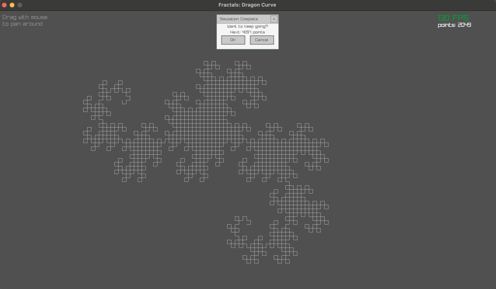

# Dragon Curve simulation using Odin + Raylib

### Live Web Demo
https://rajasharan.github.io/odin-raylib-dragon-curve/

### Run locally
```sh
$ odin run fractals.odin -file
```

### Native build screenshot


### Credits
- [Coding Some Fractals - by wye](https://www.youtube.com/watch?v=hjhMh0R9T1Y)
- [Make games using Odin + Raylib that work in the browser](https://github.com/karl-zylinski/odin-raylib-web)
- [Odin 7 Day Jam - Hosted by Karl Zylinski](https://itch.io/jam/odin-7-day-jam)

### [License](/LICENSE)
The MIT License (MIT)
